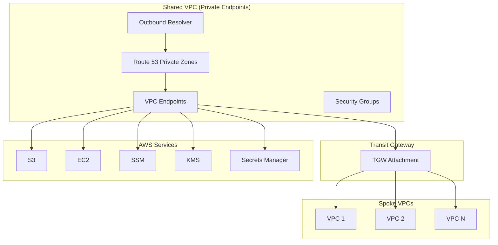
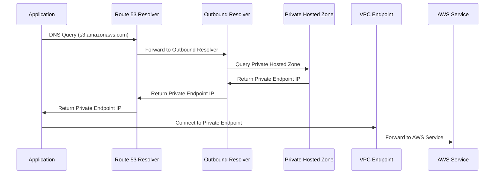

<!-- markdownlint-disable -->

<a href="https://www.appvia.io/"></a><br/><p align="right"> <a href="https://registry.terraform.io/modules/appvia/private-endpoints/aws/latest"></a></a> <a href="https://github.com/appvia/terraform-aws-private-endpoints/releases/latest"></a> <a href="https://appvia-community.slack.com/join/shared_invite/zt-1s7i7xy85-T155drryqU56emm09ojMVA#/shared-invite/email"></a> <a href="https://github.com/appvia/terraform-aws-private-endpoints/graphs/contributors"></a>

<!-- markdownlint-restore -->
<!--
  ***** CAUTION: DO NOT EDIT ABOVE THIS LINE ******
-->


# Terraform AWS Private Endpoints

<p align="center">
  </br>
  
</p>
<em>The diagram above is a high level representation of the module and the resources it creates; note in this design we DO NOT create an inbound resolver, as its not technically required</em>

## Overview

The Terraform AWS Private Endpoints module provides a comprehensive, enterprise-grade solution for implementing centralized private endpoint services across multiple VPCs using AWS PrivateLink and Transit Gateway connectivity. This module enables organizations to maintain private connectivity to AWS services, reduce internet traffic, improve security posture, and optimize network costs through centralized endpoint management and DNS resolution.

## Purpose & Intent

### **Problem Statement**

Large enterprises face significant challenges when implementing private connectivity to AWS services across multiple VPCs and accounts:

- **Internet Traffic Exposure**: AWS service calls traversing the public internet, creating security risks
- **Cost Inefficiency**: Multiple VPCs creating duplicate private endpoints, increasing costs
- **DNS Resolution Complexity**: Difficulty in routing DNS queries to private endpoints across VPCs
- **Network Management Overhead**: Manual configuration of private endpoints and DNS resolution
- **Security Gaps**: Inconsistent security policies and access controls across private endpoints
- **Compliance Challenges**: Difficulty in maintaining private connectivity requirements
- **Operational Complexity**: Lack of centralized management for private endpoint services

### **Solution**

This module provides a centralized, automated approach to private endpoint management that:

- **Centralizes Private Connectivity**: Implements a shared VPC with private endpoints for common AWS services
- **Automates DNS Resolution**: Provides Route 53 resolver rules for automatic DNS routing to private endpoints
- **Enables Cross-VPC Sharing**: Uses AWS RAM to share private endpoints across organizational units
- **Reduces Internet Traffic**: Keeps AWS service calls within the private network infrastructure
- **Provides Security Controls**: Implements consistent security groups and access policies
- **Supports Compliance**: Ensures private connectivity requirements are met across the organization
- **Reduces Operational Overhead**: Automates private endpoint provisioning and DNS configuration

## Key Features

### 🔗 **Comprehensive Private Endpoint Management**

- **Multi-Service Support**: Support for all AWS services that support PrivateLink (S3, EC2, SSM, KMS, Secrets Manager, etc.)
- **Flexible Endpoint Types**: Support for both Interface and Gateway endpoint types
- **Custom Security Groups**: Configurable security groups with fine-grained access controls
- **IAM Policy Integration**: Support for custom IAM policies on private endpoints

### 🌐 **Advanced DNS Resolution**

- **Route 53 Integration**: Automatic creation of private hosted zones for each service
- **Resolver Rules**: Automated DNS resolution rules for cross-VPC endpoint access
- **Outbound Resolvers**: Optional outbound DNS resolvers for enhanced DNS management
- **Multi-Protocol Support**: Support for Do53 and DoH protocols

### 🏗️ **Enterprise Network Architecture**

- **Transit Gateway Integration**: Seamless integration with AWS Transit Gateway for cross-VPC connectivity
- **VPC Flexibility**: Support for creating new VPCs or reusing existing network infrastructure
- **Multi-AZ Deployment**: High availability across multiple availability zones
- **IPAM Integration**: Support for AWS IPAM for IP address management

### 📊 **Resource Sharing & Access Control**

- **AWS RAM Integration**: Share private endpoints across organizational units using AWS Resource Access Manager
- **Principal Management**: Flexible principal association for cross-account access
- **Access Auditing**: Comprehensive logging and monitoring of endpoint access
- **Security Controls**: Consistent security policies across all shared endpoints

### 🛡️ **Security & Compliance**

- **Private Connectivity**: All traffic remains within AWS private network infrastructure
- **Security Group Management**: Automated security group creation with best practices
- **Access Control**: Fine-grained control over endpoint access and permissions
- **Compliance Support**: Built-in support for regulatory and compliance requirements

### ⚙️ **Operational Excellence**

- **Terraform State Management**: Full Terraform state management for all resources
- **Resource Tagging**: Consistent tagging across all created resources
- **Output Management**: Comprehensive outputs for integration with other modules
- **Dependency Management**: Proper resource dependencies and lifecycle management
- **Validation**: Built-in input validation for security and compliance

## How it works

- A shared vpc called `var.name` is created and attached to the transit gateway. Note, this module does not perform any actions on the transit gateway, it is assumed the correct settings to enable connectivity between the `var.name` vpc and the spokes is in place.
- Inside the shared vpc the private endpoints are created, one for each service defined in `var.endpoints`. The default security groups permits all https traffic from `10.0.0.0/8` to ingress.
- Optionally, depending on the configuration of the module, a outbound resolver is created. The outbound resolver is used to resolve the AWS services, against the default VPC resolver (VPC+2 ip)
- Route53 resolver rules are created for each of the shared private endpoints, allowing the consumer to pick and choose which endpoints they want to resolve to the shared vpc.
- The endpoints are shared using AWS RAM to the all the principals defined in the `var.sharing.principals` list e.g. a collection of organizational units.
- The spoke vpc's are responsible for associating the resolver rules with their vpc.
- These rules intercept the DNS queries and route them to the shared vpc resolvers, returning the private endpoint ip address located within them.
- Traffic from the spoke to the endpoints once resolved, is routed via the transit gateway.

## Architecture

### **Private Endpoint Architecture**



### **DNS Resolution Flow**



### **Supported AWS Services**

| Service | Endpoint Type | Use Cases |
|---------|---------------|-----------|
| **S3** | Gateway | Object storage access |
| **EC2** | Interface | EC2 API calls |
| **SSM** | Interface | Systems Manager |
| **SSM Messages** | Interface | SSM messaging |
| **KMS** | Interface | Key management |
| **Secrets Manager** | Interface | Secret management |
| **CloudWatch Logs** | Interface | Log aggregation |
| **DynamoDB** | Gateway | Database access |

## AWS References

- [AWS PrivateLink](https://docs.aws.amazon.com/privatelink/latest/userguide/what-is-privatelink.html)
- [Shared Private Endpoints](https://docs.aws.amazon.com/prescriptive-guidance/latest/patterns/privately-access-a-central-aws-service-endpoint-from-multiple-vpcs.html)

## Usage

### **Basic Usage - Complete Infrastructure**

This example demonstrates how to create a complete private endpoint infrastructure from scratch. It provisions a new VPC with private subnets, creates private endpoints for common AWS services, sets up DNS resolution with Route 53 private hosted zones, and shares the endpoints across organizational units using AWS RAM. This is ideal for organizations setting up centralized private connectivity for the first time.

```hcl
module "private_endpoints" {
  source = "appvia/private-endpoints/aws"
  version = "0.1.0"

  name   = "shared-endpoints"
  region = "us-west-2"
  tags = {
    Environment = "production"
    Purpose     = "private-connectivity"
    Owner       = "platform-team"
  }

  # Define private endpoints for AWS services
  endpoints = {
    "s3" = {
      service = "s3"
    },
    "ec2" = {
      service = "ec2"
    },
    "ec2messages" = {
      service = "ec2messages"
    },
    "ssm" = {
      service = "ssm"
    },
    "ssmmessages" = {
      service = "ssmmessages"
    },
    "logs" = {
      service = "logs"
    },
    "kms" = {
      service = "kms"
    },
    "secretsmanager" = {
      service = "secretsmanager"
    }
  }

  # Share endpoints with organizational units
  sharing = {
    principals = [
      "arn:aws:organizations::111111111111:organization/o-1234567890",
      "arn:aws:organizations::111111111111:ou/o-1234567890/ou-production"
    ]
  }

  # Configure outbound resolver
  resolvers = {
    outbound = {
      create            = true
      ip_address_offset = 12
      protocols         = ["Do53", "DoH"]
    }
  }

  # Network configuration
  network = {
    name = "shared-endpoints"
    availability_zones = 3
    private_netmask    = 24
    transit_gateway_id = "tgw-1234567890abcdef0"
    vpc_cidr          = "10.20.0.0/21"
  }
}
```

### **Advanced Usage - Custom Security and Policies**

This example shows how to implement advanced security controls and custom IAM policies for private endpoints. It demonstrates custom security groups for specific services, IAM policies for fine-grained access control, resolver rules sharing, and IPAM integration for IP address management. This configuration is suitable for organizations with strict security requirements and compliance needs.

```hcl
module "private_endpoints" {
  source = "appvia/private-endpoints/aws"
  version = "0.1.0"

  name   = "secure-endpoints"
  region = "us-west-2"
  tags = {
    Environment     = "production"
    Purpose         = "secure-connectivity"
    BusinessUnit    = "security"
    DataClassification = "confidential"
  }

  # Advanced endpoint configuration
  endpoints = {
    "s3" = {
      service = "s3"
      service_type = "Gateway"
      policy = jsonencode({
        Version = "2012-10-17"
        Statement = [
          {
            Effect = "Allow"
            Principal = "*"
            Action = "s3:GetObject"
            Resource = "arn:aws:s3:::secure-bucket/*"
          }
        ]
      })
    },
    "kms" = {
      service = "kms"
      service_type = "Interface"
      security_group_ids = ["sg-custom-kms-12345"]
    },
    "secretsmanager" = {
      service = "secretsmanager"
      service_type = "Interface"
      security_group_ids = ["sg-custom-secrets-67890"]
    }
  }

  # Share with specific principals
  sharing = {
    principals = [
      "arn:aws:organizations::111111111111:ou/o-1234567890/ou-production",
      "arn:aws:organizations::111111111111:ou/o-1234567890/ou-staging"
    ]
  }

  # Configure resolver rules sharing
  resolver_rules = {
    principals = [
      "arn:aws:organizations::111111111111:ou/o-1234567890/ou-production"
    ]
    share_prefix = "private-endpoints"
  }

  # Advanced resolver configuration
  resolvers = {
    outbound = {
      create            = true
      ip_address_offset = 10
      protocols         = ["Do53", "DoH"]
    }
  }

  # Network configuration with IPAM
  network = {
    name = "secure-endpoints"
    availability_zones = 3
    private_netmask    = 24
    transit_gateway_id = "tgw-1234567890abcdef0"
    vpc_cidr          = "10.20.0.0/21"
    ipam_pool_id      = "ipam-pool-1234567890abcdef0"
    vpc_netmask       = 21
  }
}
```

### **Reuse Existing Network**

This example demonstrates how to integrate private endpoints into an existing VPC infrastructure. Instead of creating a new VPC, it reuses an existing VPC and subnets, making it ideal for organizations that already have established network infrastructure but want to add centralized private endpoint services. This approach minimizes changes to existing networking while adding private connectivity capabilities.

```hcl
module "private_endpoints" {
  source = "appvia/private-endpoints/aws"
  version = "0.1.0"

  name   = "endpoints-existing-vpc"
  region = "us-west-2"
  tags = {
    Environment = "production"
    Purpose     = "private-connectivity"
  }

  endpoints = {
    "ec2" = {
      service = "ec2"
    },
    "ssm" = {
      service = "ssm"
    },
    "kms" = {
      service = "kms"
    }
  }

  sharing = {
    principals = [
      "arn:aws:organizations::111111111111:organization/o-1234567890"
    ]
  }

  resolvers = {
    outbound = {
      create            = true
      ip_address_offset = 10
    }
  }

  # Reuse existing network
  network = {
    vpc_cidr = "10.10.0.0/16"
    vpc_id   = "vpc-1234567890abcdef0"
    private_subnet_cidr_by_id = {
      "subnet-1234567890abcdef0" = "10.10.1.0/24"
      "subnet-0987654321fedcba0" = "10.10.2.0/24"
    }
    create = false
  }
}
```

### **Use Cases**

#### **1. Enterprise Centralized Connectivity**

This use case demonstrates a comprehensive enterprise setup for large organizations with centralized networking requirements. It creates a full suite of private endpoints for core AWS services and shares them across the entire organization. This configuration is designed for enterprises that need to maintain private connectivity to AWS services while providing centralized management and cost optimization through shared infrastructure.

```hcl
# For large enterprises with centralized networking
module "enterprise_endpoints" {
  source = "appvia/private-endpoints/aws"
  
  name   = "enterprise-endpoints"
  region = "us-west-2"
  
  tags = {
    Environment = "production"
    Purpose     = "enterprise-connectivity"
    BusinessUnit = "infrastructure"
  }

  endpoints = {
    "s3" = { service = "s3" }
    "ec2" = { service = "ec2" }
    "ssm" = { service = "ssm" }
    "kms" = { service = "kms" }
    "secretsmanager" = { service = "secretsmanager" }
    "logs" = { service = "logs" }
  }

  sharing = {
    principals = [
      "arn:aws:organizations::111111111111:organization/o-1234567890"
    ]
  }

  resolvers = {
    outbound = {
      create = true
      ip_address_offset = 12
    }
  }

  network = {
    name = "enterprise-endpoints"
    availability_zones = 3
    private_netmask = 24
    transit_gateway_id = var.enterprise_transit_gateway_id
    vpc_cidr = "10.100.0.0/21"
  }
}
```

#### **2. Development Environment**

This use case shows a simplified setup for development and testing environments. It creates a minimal set of private endpoints for essential services and shares them only with development organizational units. This configuration balances private connectivity needs with cost efficiency, making it ideal for development teams that need secure access to AWS services without the complexity of a full enterprise setup.

```hcl
# For development and testing environments
module "dev_endpoints" {
  source = "appvia/private-endpoints/aws"
  
  name   = "dev-endpoints"
  region = "us-west-2"
  
  tags = {
    Environment = "development"
    Purpose     = "dev-connectivity"
  }

  endpoints = {
    "s3" = { service = "s3" }
    "ec2" = { service = "ec2" }
    "ssm" = { service = "ssm" }
  }

  sharing = {
    principals = [
      "arn:aws:organizations::111111111111:ou/o-1234567890/ou-development"
    ]
  }

  network = {
    name = "dev-endpoints"
    availability_zones = 2
    private_netmask = 24
    transit_gateway_id = var.dev_transit_gateway_id
    vpc_cidr = "10.200.0.0/21"
  }
}
```

#### **3. Compliance-Focused Setup**

This use case demonstrates a security-focused configuration designed for organizations with strict compliance requirements. It implements custom IAM policies for KMS access, restricts sharing to compliance-specific organizational units, and uses enhanced tagging for audit trails. This configuration is ideal for organizations in regulated industries that need to maintain strict control over data access and demonstrate compliance with security standards.

```hcl
# For organizations with strict compliance requirements
module "compliance_endpoints" {
  source = "appvia/private-endpoints/aws"
  
  name   = "compliance-endpoints"
  region = "us-west-2"
  
  tags = {
    Environment = "production"
    Purpose     = "compliance-connectivity"
    Compliance  = "required"
    DataClassification = "confidential"
  }

  endpoints = {
    "kms" = {
      service = "kms"
      policy = jsonencode({
        Version = "2012-10-17"
        Statement = [
          {
            Effect = "Allow"
            Principal = "*"
            Action = "kms:*"
            Resource = "*"
            Condition = {
              StringEquals = {
                "kms:ViaService" = "kms.us-west-2.amazonaws.com"
              }
            }
          }
        ]
      })
    },
    "secretsmanager" = {
      service = "secretsmanager"
    }
  }

  sharing = {
    principals = [
      "arn:aws:organizations::111111111111:ou/o-1234567890/ou-compliance"
    ]
  }

  network = {
    name = "compliance-endpoints"
    availability_zones = 3
    private_netmask = 24
    transit_gateway_id = var.compliance_transit_gateway_id
    vpc_cidr = "10.50.0.0/21"
  }
}
```

## Reuse Existing Network

In order to reuse and existing network (vpc), we need to pass the vpc_id and the subnets ids where the outbound resolver will be provisioned (assuming you are not reusing an existing resolver as well).

```hcl
## Provision the endpoints and resolvers
module "endpoints" {
  source = "../.."

  name = "endpoints"
  tags = var.tags
  endpoints = {
    "ec2" = {
      service = "ec2"
    },
    "ec2messages" = {
      service = "ec2messages"
    },
    "ssm" = {
      service = "ssm"
    },
    "ssmmessages" = {
      service = "ssmmessages"
    },
  }

  sharing = {
    principals = values(var.ram_principals)
  }

  resolvers = {
    outbound = {
      create            = true
      ip_address_offset = 10
    }
  }

  network = {
    ## The vpc_cidr of the network we are reusing
    vpc_cidr = <VPC_CIDR>
    ## Reuse the network we created above
    vpc_id = <VPC_ID>
    ## Reuse the private subnets we created above i.e subnet-id => cidr
    private_subnet_cidrs_by_id = module.network.private_subnet_cidrs_by_id
    ## Do not create a new network
    create = false
  }
}
```

## Monitoring & Troubleshooting

### **CloudWatch Logs and Metrics**

The module creates comprehensive monitoring capabilities:

```bash
# View VPC endpoints
aws ec2 describe-vpc-endpoints --filters "Name=tag:Name,Values=*endpoints*"

# Check Route 53 private hosted zones
aws route53 list-hosted-zones-by-vpc --vpc-id vpc-1234567890abcdef0

# Monitor resolver endpoints
aws route53resolver list-resolver-endpoints

# Check resolver rules
aws route53resolver list-resolver-rules

# View RAM resource shares
aws ram get-resource-shares --resource-owner SELF
```

### **Key Monitoring Metrics**

| Service | Metric | Description | Use Case |
|---------|--------|-------------|----------|
| VPC Endpoints | `DataProcessed` | Data processed through endpoints | Monitor endpoint usage |
| VPC Endpoints | `PacketsDropped` | Packets dropped by endpoints | Monitor endpoint health |
| Route 53 | `DNSQueries` | DNS queries to private hosted zones | Monitor DNS resolution |
| Route 53 Resolver | `ResolverQueries` | Resolver query volume | Monitor resolver usage |
| RAM | `ResourceShares` | Number of active resource shares | Monitor sharing activity |

### **Common Issues & Solutions**

#### **1. VPC Endpoint Creation Failures**

```
Error: Failed to create VPC endpoint
```

**Solutions**:

- Verify service name is correct and supported
- Check VPC and subnet configuration
- Ensure security groups allow HTTPS traffic
- Verify IAM permissions for endpoint creation

#### **2. DNS Resolution Issues**

```
Error: DNS queries not resolving to private endpoints
```

**Solutions**:

- Check Route 53 private hosted zone configuration
- Verify resolver rules are properly configured
- Ensure outbound resolver is accessible
- Check VPC DNS settings

#### **3. Cross-VPC Connectivity Issues**

```
Error: Cannot reach private endpoints from spoke VPCs
```

**Solutions**:

- Verify Transit Gateway configuration
- Check route table associations
- Ensure security groups allow traffic
- Verify RAM resource sharing configuration

#### **4. RAM Sharing Issues**

```
Error: Resource sharing failed
```

**Solutions**:

- Verify principal ARNs are correct
- Check RAM permissions
- Ensure principals are valid AWS accounts or OUs
- Verify resource share configuration

### **Operational Best Practices**

1. **Network Planning**: Plan VPC CIDR ranges to avoid conflicts
2. **Security Groups**: Use least privilege principles for security group rules
3. **Monitoring**: Implement comprehensive monitoring and alerting
4. **Documentation**: Maintain clear documentation of endpoint configurations
5. **Testing**: Regularly test endpoint connectivity and DNS resolution

## Requirements

### **Prerequisites**

- AWS VPC with private subnets
- Transit Gateway for cross-VPC connectivity
- Appropriate IAM permissions for VPC endpoints and Route 53
- AWS RAM for resource sharing (if using sharing features)

### **AWS Services Used**

- AWS VPC Endpoints (PrivateLink)
- Amazon Route 53 (Private Hosted Zones)
- AWS Route 53 Resolver
- AWS Resource Access Manager (RAM)
- AWS Transit Gateway
- AWS VPC

### **Permissions Required**

- VPC endpoint management
- Route 53 private hosted zone management
- Route 53 resolver management
- RAM resource sharing (if using sharing features)
- Transit Gateway attachment permissions

## Update Documentation

The `terraform-docs` utility is used to generate this README. Follow the below steps to update:

1. Make changes to the `.terraform-docs.yml` file
2. Fetch the `terraform-docs` binary (<https://terraform-docs.io/user-guide/installation/>)
3. Run `terraform-docs markdown table --output-file ${PWD}/README.md --output-mode inject .`

<!-- BEGIN_TF_DOCS -->
## Providers

| Name | Version |
|------|---------|
| <a name="provider_aws"></a> [aws](#provider\_aws) | >= 5.0.0 |

## Inputs

| Name | Description | Type | Default | Required |
|------|-------------|------|---------|:--------:|
| <a name="input_name"></a> [name](#input\_name) | The name of the environment | `string` | n/a | yes |
| <a name="input_network"></a> [network](#input\_network) | The network to use for the endpoints and optinal resolvers | <pre>object({<br/>    availability_zones = optional(number, 2)<br/>    # Indicates if we should create a new network or reuse an existing one<br/>    enable_default_route_table_association = optional(bool, true)<br/>    # Whether to associate the default route table<br/>    enable_default_route_table_propagation = optional(bool, true)<br/>    # Whether to propagate the default route table<br/>    enable_dynamodb_endpoint = optional(bool, false)<br/>    # Whether to enable the dynamodb endpoint<br/>    enable_route53_resolver_rules = optional(bool, false)<br/>    # Whether to enable the route53 resolver rules<br/>    enable_s3_endpoint = optional(bool, false)<br/>    # Whether to enable the s3 endpoint<br/>    ipam_pool_id = optional(string, null)<br/>    # The id of the ipam pool to use when creating the network<br/>    private_netmask = optional(number, 24)<br/>    # The subnet mask for private subnets, when creating the network i.e subnet-id => 10.90.0.0/24<br/>    private_subnet_cidr_by_id = optional(map(string), {})<br/>    # The ids of the private subnets to if we are reusing an existing network<br/>    transit_gateway_id = optional(string, null)<br/>    ## The transit gateway id to use for the network<br/>    vpc_cidr = optional(string, "")<br/>    # The cidrws range to use for the VPC, when creating the network<br/>    vpc_dns_resolver = optional(string, null)<br/>    # The ip address to use for the vpc dns resolver<br/>    vpc_id = optional(string, "")<br/>    # The vpc id to use when reusing an existing network<br/>    vpc_netmask = optional(number, null)<br/>    # When using ipam this the netmask to use for the VPC<br/>  })</pre> | n/a | yes |
| <a name="input_region"></a> [region](#input\_region) | The region to deploy the resources | `string` | n/a | yes |
| <a name="input_tags"></a> [tags](#input\_tags) | The tags to apply to the resources | `map(string)` | n/a | yes |
| <a name="input_endpoints"></a> [endpoints](#input\_endpoints) | The private endpoints to provision within the shared vpc | <pre>map(object({<br/>    # The route table ids to use for the endpoint, assuming a gateway endpoint<br/>    route_table_ids = optional(list(string), null)<br/>    # service_type of the endpoint i.e. Gateway, Interface<br/>    service_type = optional(string, "Interface")<br/>    # The security group ids to use for the endpoint, else create on the fly<br/>    security_group_ids = optional(list(string), null)<br/>    # The AWS service we are creating a endpoint for<br/>    service = string<br/>    # The IAM policy associated to the endpoint<br/>    policy = optional(string, null)<br/>  }))</pre> | <pre>{<br/>  "ec2": {<br/>    "service": "ec2"<br/>  },<br/>  "ec2messages": {<br/>    "service": "ec2messages"<br/>  },<br/>  "ssm": {<br/>    "service": "ssm"<br/>  },<br/>  "ssmmessages": {<br/>    "service": "ssmmessages"<br/>  }<br/>}</pre> | no |
| <a name="input_resolver_rules"></a> [resolver\_rules](#input\_resolver\_rules) | The configuration for sharing the resolvers to other accounts | <pre>object({<br/>    principals = optional(list(string), [])<br/>    ## The principals to share the resolvers with<br/>    share_prefix = optional(string, "resolvers")<br/>    # The preifx to use for the shared resolvers<br/>  })</pre> | `{}` | no |
| <a name="input_resolvers"></a> [resolvers](#input\_resolvers) | The resolvers to provision | <pre>object({<br/>    outbound = object({<br/>      ip_address_offset = optional(number, 10)<br/>      # If creating the outbound resolver, the address offset to use i.e if 10.100.0.0/24, offset 10, ip address would be 10.100.0.10<br/>      protocols = optional(list(string), ["Do53", "DoH"])<br/>      # The protocols to use for the resolver<br/>      use_existing = optional(string, null)<br/>      # When not creating the resolver, this is the name of the resolver to use<br/>    })<br/>    # The configuration for the outbound resolver<br/>  })</pre> | `null` | no |

## Outputs

| Name | Description |
|------|-------------|
| <a name="output_endpoints"></a> [endpoints](#output\_endpoints) | Array containing the full resource object and attributes for all endpoints created |
| <a name="output_hosted_zone"></a> [hosted\_zone](#output\_hosted\_zone) | A full list of the private hosted zones created |
| <a name="output_hosted_zone_map"></a> [hosted\_zone\_map](#output\_hosted\_zone\_map) | A map of the private hosted zones created |
| <a name="output_outbound_resolver_endpoint_id"></a> [outbound\_resolver\_endpoint\_id](#output\_outbound\_resolver\_endpoint\_id) | The id of the outbound resolver if we created one |
| <a name="output_outbound_resolver_ip_addresses"></a> [outbound\_resolver\_ip\_addresses](#output\_outbound\_resolver\_ip\_addresses) | The ip addresses of the outbound resolver if we created one |
| <a name="output_private_subnet_attributes_by_az"></a> [private\_subnet\_attributes\_by\_az](#output\_private\_subnet\_attributes\_by\_az) | The attributes of the private subnets |
| <a name="output_resolver_security_group_id"></a> [resolver\_security\_group\_id](#output\_resolver\_security\_group\_id) | The id of the security group we created for the endpoints if we created one |
| <a name="output_rt_attributes_by_type_by_az"></a> [rt\_attributes\_by\_type\_by\_az](#output\_rt\_attributes\_by\_type\_by\_az) | The attributes of the route tables |
| <a name="output_transit_gateway_attachment_id"></a> [transit\_gateway\_attachment\_id](#output\_transit\_gateway\_attachment\_id) | The id of the transit gateway we used to provision the endpoints |
| <a name="output_vpc_attributes"></a> [vpc\_attributes](#output\_vpc\_attributes) | The attributes of the vpc we created |
| <a name="output_vpc_id"></a> [vpc\_id](#output\_vpc\_id) | The id of the vpc we used to provision the endpoints |
<!-- END_TF_DOCS -->

```