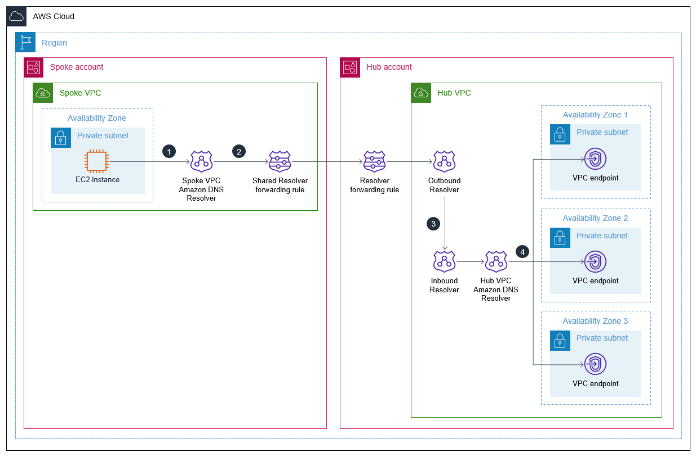

# Terraform AWS Private Endpoints

<p align="center">
  </br>
  
</p>
<em>The diagram above is a high level representation of the module and the resources it creates; note in this design we DO NOT create an inbound resolver, as its not technically required</em>

## Description

The following module provides a AWS recommended pattern for sharing private endpoint services across multiple VPCs, interconnected via a transit gateway. The intent is to retain as much of the traffic directed to AWS services, private and off the internet. Used in combination with the [terraform-aws-connectivity](https://github.com/appvia/terraform-aws-connectivity).

## How it works

- A shared vpc called `var.name` is created and attached to the transit gateway. Note, this module does not perform any actions on the transit gateway, it is assumed the correct settings to enable connectivity between the `var.name` vpc and the spokes is in place.
- Inside the shared vpc the private endpoints are created, one for each service defined in `var.endpoints`. The default security groups permits all https traffic from `10.0.0.0/8` to ingress.
- Optionally, depending on the configuration of the module, a outbound resolver is created. The outbound resolver is used to resolve the AWS services, against the default VPC resolver (VPC+2 ip)
- Route53 resolver rules are created for each of the shared private endpoints, allowing the consumer to pick and choose which endpoints they want to resolve to the shared vpc.
- The endpoints are shared using AWS RAM to the all the principals defined in the `var.sharing.principals` list e.g. a collection of organizational units.
- The spoke vpc's are responsible for associating the resolver rules with their vpc.
- These rules intercept the DNS queries and route them to the shared vpc resolvers, returning the private endpoint ip address located within them.
- Traffic from the spoke to the endpoints once resolved, is routed via the transit gateway.

## AWS References

- [AWS PrivateLink](https://docs.aws.amazon.com/privatelink/latest/userguide/what-is-privatelink.html)
- [Shared Private Endpoints](https://docs.aws.amazon.com/prescriptive-guidance/latest/patterns/privately-access-a-central-aws-service-endpoint-from-multiple-vpcs.html)

## Usage

```hcl
## Provision the endpoints and resolvers
module "endpoints" {
  source = "../.."

  name = "endpoints"
  tags = var.tags
  endpoints = {
    "s3" = {
      service = "s3"
    },
    "ec2" = {
      service = "ec2"
    },
    "ec2messages" = {
      service = "ec2messages"
    },
    "ssm" = {
      service = "ssm"
    },
    "ssmmessages" = {
      service = "ssmmessages"
    },
    "logs" = {
      service = "logs"
    },
    "kms" = {
      service = "kms"
    },
    "secretsmanager" = {
      service = "secretsmanager"
    }
  }

  sharing = {
    principals = values(var.ram_principals)
  }

  resolvers = {
    outbound = {
      create            = true
      ip_address_offset = 12
    }
  }

  network = {
    # Name of the network to create
    name = "endpoints"
    # Number of availability zones to create subnets in
    private_netmask = 24
    # The transit gateway to connect
    transit_gateway_id = var.transit_gateway_id
    # The cider range to use for the VPC
    vpc_cidr = "10.20.0.0/21"
  }
}
```

## Reuse Existing Network

In order to reuse and existing network (vpc), we need to pass the vpc_id and the subnets ids where the outbound resolver will be provisioned (assuming you are not reusing an existing resolver as well).

```hcl
## Provision the endpoints and resolvers
module "endpoints" {
  source = "../.."

  name = "endpoints"
  tags = var.tags
  endpoints = {
    "ec2" = {
      service = "ec2"
    },
    "ec2messages" = {
      service = "ec2messages"
    },
    "ssm" = {
      service = "ssm"
    },
    "ssmmessages" = {
      service = "ssmmessages"
    },
  }

  sharing = {
    principals = values(var.ram_principals)
  }

  resolvers = {
    outbound = {
      create            = true
      ip_address_offset = 10
    }
  }

  network = {
    ## Reuse the network we created above
    vpc_id = <VPC_ID>
    ## Reuse the private subnets we created above i.e subnet-id => cidr
    private_subnet_cidrs_by_id = module.network.private_subnet_cidrs_by_id
    ## Do not create a new network
    create = false
  }
}
```

## Update Documentation

The `terraform-docs` utility is used to generate this README. Follow the below steps to update:

1. Make changes to the `.terraform-docs.yml` file
2. Fetch the `terraform-docs` binary (https://terraform-docs.io/user-guide/installation/)
3. Run `terraform-docs markdown table --output-file ${PWD}/README.md --output-mode inject .`

<!-- BEGIN_TF_DOCS -->
## Requirements

| Name | Version |
|------|---------|
| <a name="requirement_terraform"></a> [terraform](#requirement\_terraform) | >= 1.0.7 |
| <a name="requirement_aws"></a> [aws](#requirement\_aws) | >= 5.0.0 |

## Providers

| Name | Version |
|------|---------|
| <a name="provider_aws"></a> [aws](#provider\_aws) | >= 5.0.0 |

## Modules

| Name | Source | Version |
|------|--------|---------|
| <a name="module_dns_security_group"></a> [dns\_security\_group](#module\_dns\_security\_group) | terraform-aws-modules/security-group/aws | 5.1.2 |
| <a name="module_endpoints"></a> [endpoints](#module\_endpoints) | terraform-aws-modules/vpc/aws//modules/vpc-endpoints | 5.8.1 |
| <a name="module_ram_share"></a> [ram\_share](#module\_ram\_share) | ./modules/ram_share | n/a |
| <a name="module_vpc"></a> [vpc](#module\_vpc) | appvia/network/aws | 0.3.0 |

## Resources

| Name | Type |
|------|------|
| [aws_ram_resource_association.endpoints](https://registry.terraform.io/providers/hashicorp/aws/latest/docs/resources/ram_resource_association) | resource |
| [aws_ram_resource_share.endpoints](https://registry.terraform.io/providers/hashicorp/aws/latest/docs/resources/ram_resource_share) | resource |
| [aws_route53_resolver_endpoint.outbound](https://registry.terraform.io/providers/hashicorp/aws/latest/docs/resources/route53_resolver_endpoint) | resource |
| [aws_route53_resolver_rule.endpoints](https://registry.terraform.io/providers/hashicorp/aws/latest/docs/resources/route53_resolver_rule) | resource |
| [aws_route53_resolver_rule.endpoints_single](https://registry.terraform.io/providers/hashicorp/aws/latest/docs/resources/route53_resolver_rule) | resource |
| [aws_route53_resolver_endpoint.outbound](https://registry.terraform.io/providers/hashicorp/aws/latest/docs/data-sources/route53_resolver_endpoint) | data source |
| [aws_vpc.current](https://registry.terraform.io/providers/hashicorp/aws/latest/docs/data-sources/vpc) | data source |

## Inputs

| Name | Description | Type | Default | Required |
|------|-------------|------|---------|:--------:|
| <a name="input_name"></a> [name](#input\_name) | The name of the environment | `string` | n/a | yes |
| <a name="input_network"></a> [network](#input\_network) | The network to use for the endpoints and optinal resolvers | <pre>object({<br>    availability_zones = optional(number, 2)<br>    # Whether to use ipam when creating the network<br>    create = optional(bool, true)<br>    # Indicates if we should create a new network or reuse an existing one<br>    ipam_pool_id = optional(string, null)<br>    # The id of the ipam pool to use when creating the network<br>    private_netmask = optional(number, 24)<br>    # The subnet mask for private subnets, when creating the network i.e subnet-id => 10.90.0.0/24<br>    private_subnet_cidr_by_id = optional(map(string), {})<br>    # The ids of the private subnets to if we are reusing an existing network<br>    transit_gateway_id = optional(string, "")<br>    ## The transit gateway id to use for the network<br>    vpc_cidr = optional(string, "")<br>    # The cidrws range to use for the VPC, when creating the network<br>    vpc_id = optional(string, "")<br>    # The vpc id to use when reusing an existing network <br>    vpc_netmask = optional(number, null)<br>    # When using ipam this the netmask to use for the VPC<br>  })</pre> | n/a | yes |
| <a name="input_region"></a> [region](#input\_region) | The region to deploy the resources | `string` | n/a | yes |
| <a name="input_resolvers"></a> [resolvers](#input\_resolvers) | The resolvers to provision | <pre>object({<br>    # Indicates we create a single resolver rule, rather than one per service_type <br>    create_single_resolver_rule = optional(bool, false)<br>    # The configuration for the outbound resolver<br>    outbound = object({<br>      # Whether to create the resolver<br>      create = optional(bool, true)<br>      # If creating the outbound resolver, the address offset to use i.e if 10.100.0.0/24, offset 10, ip address would be 10.100.0.10<br>      ip_address_offset = optional(number, 10)<br>      # The protocols to use for the resolver<br>      protocols = optional(list(string), ["Do53", "DoH"])<br>      # When not creating the resolver, this is the name of the resolver to use<br>      use_existing = optional(string, null)<br>    })<br>  })</pre> | n/a | yes |
| <a name="input_tags"></a> [tags](#input\_tags) | The tags to apply to the resources | `map(string)` | n/a | yes |
| <a name="input_endpoints"></a> [endpoints](#input\_endpoints) | The private endpoints to provision within the shared vpc | <pre>map(object({<br>    # Whether to enable private dns<br>    private_dns_enabled = optional(bool, true)<br>    # The route table ids to use for the endpoint, assuming a gateway endpoint<br>    route_table_ids = optional(list(string), null)<br>    # service_type of the endpoint i.e. Gateway, Interface<br>    service_type = optional(string, "Interface")<br>    # The security group ids to use for the endpoint, else create on the fly<br>    security_group_ids = optional(list(string), null)<br>    # The AWS service we are creating a endpoint for<br>    service = string<br>    # The IAM policy associated to the endpoint <br>    policy = optional(string, null)<br>  }))</pre> | <pre>{<br>  "ec2": {<br>    "service": "ec2"<br>  },<br>  "ec2messages": {<br>    "service": "ec2messages"<br>  },<br>  "ssm": {<br>    "service": "ssm"<br>  },<br>  "ssmmessages": {<br>    "service": "ssmmessages"<br>  }<br>}</pre> | no |
| <a name="input_sharing"></a> [sharing](#input\_sharing) | The configuration for sharing the resolvers to other accounts | <pre>object({<br>    ## The principals to share the resolvers with <br>    principals = optional(list(string), null)<br>    # The preifx to use for the shared resolvers<br>    share_prefix = optional(string, "resolvers")<br>  })</pre> | <pre>{<br>  "principals": []<br>}</pre> | no |

## Outputs

| Name | Description |
|------|-------------|
| <a name="output_endpoints"></a> [endpoints](#output\_endpoints) | The attributes of the endpoints we created |
| <a name="output_outbound_resolver_endpoint_id"></a> [outbound\_resolver\_endpoint\_id](#output\_outbound\_resolver\_endpoint\_id) | The id of the outbound resolver if we created one |
| <a name="output_outbound_resolver_ip_addresses"></a> [outbound\_resolver\_ip\_addresses](#output\_outbound\_resolver\_ip\_addresses) | The ip addresses of the outbound resolver if we created one |
| <a name="output_private_subnet_attributes_by_az"></a> [private\_subnet\_attributes\_by\_az](#output\_private\_subnet\_attributes\_by\_az) | The attributes of the private subnets |
| <a name="output_resolver_security_group_id"></a> [resolver\_security\_group\_id](#output\_resolver\_security\_group\_id) | The id of the security group we created for the endpoints if we created one |
| <a name="output_rt_attributes_by_type_by_az"></a> [rt\_attributes\_by\_type\_by\_az](#output\_rt\_attributes\_by\_type\_by\_az) | The attributes of the route tables |
| <a name="output_vpc_attributes"></a> [vpc\_attributes](#output\_vpc\_attributes) | The attributes of the vpc we created |
| <a name="output_vpc_id"></a> [vpc\_id](#output\_vpc\_id) | The id of the vpc we used to provision the endpoints |
<!-- END_TF_DOCS -->

```

```
